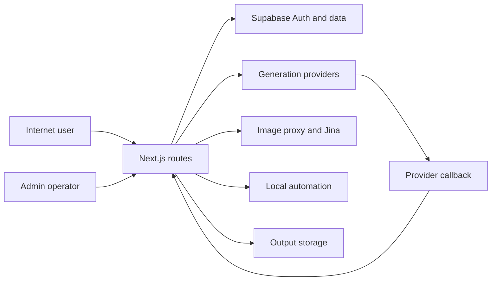

# Seedance2 / Image2 Threat Model

## Executive summary

This Next.js repository serves public Image2 case browsing alongside authenticated Image2/Picture features and older Seedance APIs. The largest threat is boundary confusion: some modern flows derive identity from a verified Supabase bearer token, while legacy and fallback flows trust body/query/custom headers or deployment host headers. That inconsistency, combined with public provider and automation endpoints, exposes integrity and availability-critical resources even though several newer components have good server-side controls.

## Scope and assumptions

**In scope:** `app/api/**`, relevant page/client auth flows, `lib/**` auth/storage/provider modules, `proxy.ts`, `next.config.mjs`, Docker/Vercel config, and Supabase migrations.

**Out of scope:** Live Vercel headers, external WAF/proxy, actual Supabase RLS policy state, database contents, provider accounts, and secret values.

**Assumptions that affect ranking:**

- The Vercel application is reachable on public domains; route handlers have no implicit network isolation unless code or platform behavior proves it.
- Optional Docker/self-hosting may exist because a Docker image and compose file are maintained, but external exposure was not confirmed.
- Legacy Seedance endpoints may still be deployed because they remain in the application route tree; real usage was not confirmed.
- Billable upstream provider credentials may be configured on one or more public domains; this was not confirmed.
- Supabase is the intended source of truth for Image2 account, wallet, asset, and membership data; Docker config enables the Supabase asset/Gacha modes.

**Open questions:**

- Is any Docker/self-hosted runtime reachable beyond localhost or a trusted reverse proxy?
- Do live users still use the legacy Seedance endpoints?
- Which public domains have active Doubao, RunningHub, or BytePlus/Seedance credentials?

## System model

### Primary components

- **Browser clients:** public Image2 case library, Image2/Picture login UI, workbench, Gacha, and legacy Seedance UI.
- **Next.js application:** App Router pages, `app/api/**` route handlers, host-based proxy redirects, output handlers, and public image proxy.
- **Identity and user data:** Supabase Auth via bearer tokens, Supabase PostgREST/service-role operations, plus legacy/local JSON fallbacks.
- **Generation providers:** Image2/Picture/Doubao/Seedance provider helpers and a provider callback receiver.
- **Internal tooling:** local Python/browser automation and Jina reader/search bridge.
- **Deployment/runtime:** Vercel and optional Docker container with a mounted output volume.

### Data flows and trust boundaries

- **Internet -> Next.js public routes:** prompts, images, public case data, URL query parameters, and custom headers cross HTTP. Some endpoints are public by design; legacy/internal routes lack an enforced boundary.
- **Browser -> authenticated Next.js routes:** bearer access/refresh token-derived sessions, user data, card codes, and prompts cross HTTP. Modern membership/wallet helpers call Supabase user verification; browser-readable tokens remain a client-side risk.
- **Next.js -> Supabase:** verified user context and privileged service-role database requests cross HTTPS. Service-role access is server-side in reviewed code; RLS state was not independently verified.
- **Next.js -> generation providers:** prompts/reference data and server-held credentials cross HTTPS. Some handler paths do not establish a verified actor or quota before calling the provider.
- **Provider -> callback route:** job event payloads cross HTTP into `provider/seedance/callback`; no signature or replay validation is implemented.
- **Next.js -> external URLs/local automation:** image proxy, Jina reader, and local `execFile` processes cross a high-risk SSRF/process boundary.
- **Next.js -> output storage:** local/Docker/Vercel temporary output files cross filesystem boundaries; path normalization exists but media visibility is public.

#### Diagram

## Assets and security objectives

| Asset | Why it matters | Security objective (C/I/A) |
| --- | --- | --- |
| Supabase access/refresh tokens | Identifies users and enables account persistence | C/I |
| User assets, favorites, workbench data, Picture history | Private creator work and tenant separation | C/I |
| Membership, card codes, wallet/quota, entitlement records | Controls paid/trial access and economic value | I/A |
| Provider credentials and generation budget | Billable resources and abuse target | C/A |
| Generation jobs, URLs, completion/failure state | Customer deliverable integrity and quota correctness | I/A |
| Admin access and operations records | Broad management capability and accountability | C/I |
| Local browser automation environment | Potential access to operator browser sessions | C/I/A |
| Source/build/deployment configuration | Determines runtime exposure and security controls | I/A |

## Attacker model

### Capabilities

- An unauthenticated internet caller can send arbitrary HTTP methods, JSON, query parameters, and non-standard headers to public paths.
- An attacker can automate requests and attempt rate/cost abuse.
- An attacker may hold a low-privilege account or a leaked/expired client token.
- An attacker can control remote URLs supplied to public proxy/reader routes.
- An attacker can send arbitrary provider-callback-shaped payloads.

### Non-capabilities

- No assumption that the attacker has a Supabase service-role key, Vercel control plane access, database access, or shell access to the production host.
- No assumption that any external proxy/CDN header policy, RLS policy, or provider credential configuration is insecure unless shown in source or confirmed.
- No assumption that the Docker image is publicly reachable; automation risk remains conditional on that deployment fact.

## Entry points and attack surfaces

| Surface | How reached | Trust boundary | Notes | Evidence |
| --- | --- | --- | --- | --- |
| Legacy Seedance API | Public `/api/claim`, `/api/redeem`, `/api/account`, `/api/dashboard`, `/api/generations` | Internet -> mutable store/provider | Caller supplies user identity | `app/api/{claim,redeem,account,dashboard,generations}/route.ts` |
| Image2 generation | `/api/image2`, `/api/image2/stream` | Internet -> wallet/provider | Host changes quota branch | `app/api/image2/route.ts` |
| Provider generators | `/api/doubao2api/images`, `/api/music/generations` | Internet -> provider | No visible auth/quota | Corresponding route handlers |
| Provider callback | `/api/provider/seedance/callback` | Provider/internet -> job store | No signature/replay validation | `app/api/provider/seedance/callback/route.ts` |
| Asset/Gacha fallbacks | Image2 asset/Gacha APIs | Internet -> tenant data | Auth depends on env backend flags | `app/api/image2/assets/route.ts`, `lib/image2-gacha-auth.ts` |
| Admin APIs | `/api/admin/**` | Browser -> admin data | Shared static token, not role session | `lib/admin-auth.ts` |
| Picture/OTP auth | Public login, register, OTP routes | Internet -> auth provider | Abuse controls inconsistent | `app/api/auth/otp/**`, `app/api/picture/auth/**` |
| Local automation and Jina | `/api/local-automation/**` | Internet -> subprocess/outbound HTTP | Internal operations exposed as routes | Corresponding route handlers |
| Image proxy | `/api/image2/proxy?url=` | Internet -> external fetch | Initial allowlist only | `app/api/image2/proxy/route.ts` |
| Output serving | Image2/Picture output routes | Internet -> filesystem output | Traversal controls exist; outputs public | `app/api/*/output/[...path]/route.ts` |

## Top abuse paths

1. **Legacy identity impersonation:** attacker chooses a victim or synthetic `userId` -> calls a legacy claim/redeem/account/generation route -> mutable store accepts identity -> attacker alters user/entitlement/quota state or creates provider work.
2. **Webhook job forgery:** attacker sends a callback payload with a known/guessed provider task ID -> callback accepts it unsigned -> job becomes failed/succeeded -> media URL or refund state is altered.
3. **Forwarded-host quota bypass:** attacker supplies `x-forwarded-host` -> Image2 route selects Picture mode -> wallet reservation is skipped -> configured provider resource is consumed outside intended quota policy.
4. **Anonymous provider spending:** attacker repeatedly calls public image/music generation routes -> server uses configured provider credential -> provider budget and worker capacity are consumed.
5. **Fallback tenant confusion:** an environment misses the Supabase backend flag -> request body/header controls a user context or no Gacha user context exists -> attacker accesses or changes shared data.
6. **Local automation takeover:** publicly reachable self-hosted route receives click/fill action -> Python automation invokes active desktop/browser context -> attacker drives operator-session actions.
7. **Reader/proxy abuse:** caller submits a permitted URL that redirects or a large/chunked response -> server follows/loads it -> outbound capacity or memory is consumed; Jina cost may be spent.
8. **Session theft amplification:** a separate XSS or malicious browser extension reads browser storage -> obtains access and refresh tokens -> replays user session and persists access.
9. **Admin shared-secret compromise:** admin token leaks from browser/operator context -> attacker calls any admin API -> broad administration with no individual attribution.
10. **Auth endpoint pressure:** attacker automates register/login/OTP requests -> sends excessive auth traffic and credential guesses -> provider costs and account-delivery capacity are consumed.

## Threat model table

| Threat ID | Threat source | Prerequisites | Threat action | Impact | Impacted assets | Existing controls (evidence) | Gaps | Recommended mitigations | Detection ideas | Likelihood | Impact severity | Priority |
| --- | --- | --- | --- | --- | --- | --- | --- | --- | --- | --- | --- | --- |
| TM-001 | Unauthenticated internet caller | Route remains deployed | Supply arbitrary legacy `userId` | Cross-user integrity and provider abuse | Profiles, entitlement, quota, jobs | Input validation for generation shape only | No verified identity/ownership | Retire/lock legacy routes; derive identity from session | Legacy route calls by identity/IP | High | High | critical |
| TM-002 | Forged webhook sender | Task ID is known/guessable | Submit callback status/media payload | Job tampering and refunds | Jobs, quota, user media | Task ID lookup | No signature, replay, or state validation | HMAC, timestamp, nonce, idempotency | Invalid signatures, duplicate events | Medium | High | high |
| TM-003 | Header-controlling caller | Forwarded host reaches app unchanged | Select Picture provider branch | Wallet/quota bypass | Provider budget, wallet integrity | Normal wallet reservation | Host header is authorization signal | Separate routes; explicit auth/quota | Canonical vs received host mismatch | Medium | High | high |
| TM-004 | Anonymous cost-abuse caller | Provider credential enabled | Spam public image/music generators | Denial of wallet/capacity | Provider budget, availability | Provider error handling | No auth, rate, quota, body bounds | Session, reservation, schemas, limits | Cost/user/IP endpoint telemetry | High | High | high |
| TM-005 | Remote caller to self-hosted host | Automation route publicly reachable | Trigger click/fill automation | Operator-session and host integrity loss | Local browser, operator data | `.vercelignore` excludes automation | No route auth/network isolation | Remove from web runtime; localhost IPC | Any production call is an alert | Conditional | High | high |
| TM-006 | Public caller in misconfigured deployment | Supabase flags absent | Use header/body fallback identity | Tenant data access/modification | Assets, Gacha runs, favorites | Docker enables Supabase flags | Production fails open | Fail closed; remove fallback identity | Backend-mode startup/audit event | Medium | High | high |
| TM-007 | Any user or external attacker | Vulnerable release deployed | Exploit known Next.js issue | DoS, proxy bypass, SSRF/cache issues | Availability, route boundaries | No visible compensating patch | `next@16.2.4` in advisory range | Upgrade to patched release | Dependency/advisory CI checks | Medium | High | high |
| TM-008 | Public caller | Route reachable | Abuse Jina/scout/remote URL proxy | Cost, data integrity, SSRF-like egress | Operations data, egress budget | Initial proxy allowlist | Jina/scout auth absent; redirects unbounded | Auth, allowlists, private-IP blocks, time/size caps | URL/source/error telemetry | Medium | Medium | medium |
| TM-009 | XSS/extension/local attacker | Browser has stored session | Read access/refresh tokens | Account takeover persistence | Auth artifacts, user data | Bearer verified server-side | Tokens browser-readable, no CSP baseline | HttpOnly sessions, CSP, rotation | Refresh anomaly/reuse detection | Medium | Medium | medium |
| TM-010 | Auth brute-force/spam caller | Public auth route | Automate OTP/password traffic | Cost and service degradation | Auth delivery, accounts | Turnstile on unified OTP send | No uniform route limits | Rate limits, bot controls, normalized errors | Failure/burst metrics | High | Medium | medium |

## Criticality calibration

- **Critical:** unauthenticated use of a caller-chosen identity to mutate user/quota/provider state; public cost-consuming provider route with no identity or reservation.
- **High:** unsigned callback changing job/quota state; production-exposed local automation; fail-open tenant fallback; exploitable known platform vulnerability.
- **Medium:** missing rate controls, unsafe browser token persistence, public operational-reader/scout endpoints, incomplete image-proxy control.
- **Low:** hardening that needs unusual prerequisites, such as root container runtime behind a localhost-only binding.

## Focus paths for security review

| Path | Why it matters | Related Threat IDs |
| --- | --- | --- |
| `app/api/generations/route.ts` | Legacy identity, quota, provider invocation | TM-001 |
| `app/api/{claim,redeem,account,dashboard}/route.ts` | Caller-controlled legacy identity | TM-001 |
| `lib/store.ts` | Fallback store creates arbitrary users | TM-001, TM-006 |
| `app/api/provider/seedance/callback/route.ts` | Unsigned state mutation | TM-002 |
| `app/api/image2/route.ts` | Forwarded-host provider/quota branch | TM-003 |
| `app/api/doubao2api/images/route.ts` | Public provider use | TM-004 |
| `app/api/music/generations/route.ts` | Public provider use | TM-004 |
| `app/api/local-automation/route.ts` | Subprocess/browser automation | TM-005 |
| `app/api/local-automation/jina/route.ts` | Local helper and outbound HTTP | TM-008 |
| `app/api/image2/assets/route.ts` | Fallback identity trust | TM-006 |
| `lib/image2-gacha-auth.ts` | Fail-open Gacha context | TM-006 |
| `lib/image2-gacha-store.ts` | Tenant isolation storage behavior | TM-006 |
| `lib/image2-membership.ts` | Bearer verification and service-role data path | TM-001, TM-009 |
| `lib/image2-wallet.ts` | Credit reservation/refund correctness | TM-003, TM-004 |
| `lib/picture-auth.ts` | Picture session architecture | TM-009, TM-010 |
| `components/unified-login-panel.tsx` | Browser session persistence | TM-009 |
| `next.config.mjs` | Browser security headers | TM-009, TM-010 |
| `proxy.ts` | Host/redirect trust behavior | TM-003, TM-007 |
| `app/api/image2/proxy/route.ts` | Redirect, memory, and SVG proxy risks | TM-008 |
| `Dockerfile` and `docker-compose.image2.yml` | Self-hosted exposure and runtime hardening | TM-005, TM-006 |

## Quality check

- All 48 discovered route-handler files are covered by the route exposure ledger in the companion security report.
- Every primary trust boundary appears in at least one listed threat.
- Runtime routes, Docker/self-hosting, and local automation tooling are separated in the scope and conditional severity statements.
- Deployment-context questions were asked but not answered; assumptions are explicit and affect risk rankings.
- The report avoids secret values and does not claim unverified external infrastructure controls.
